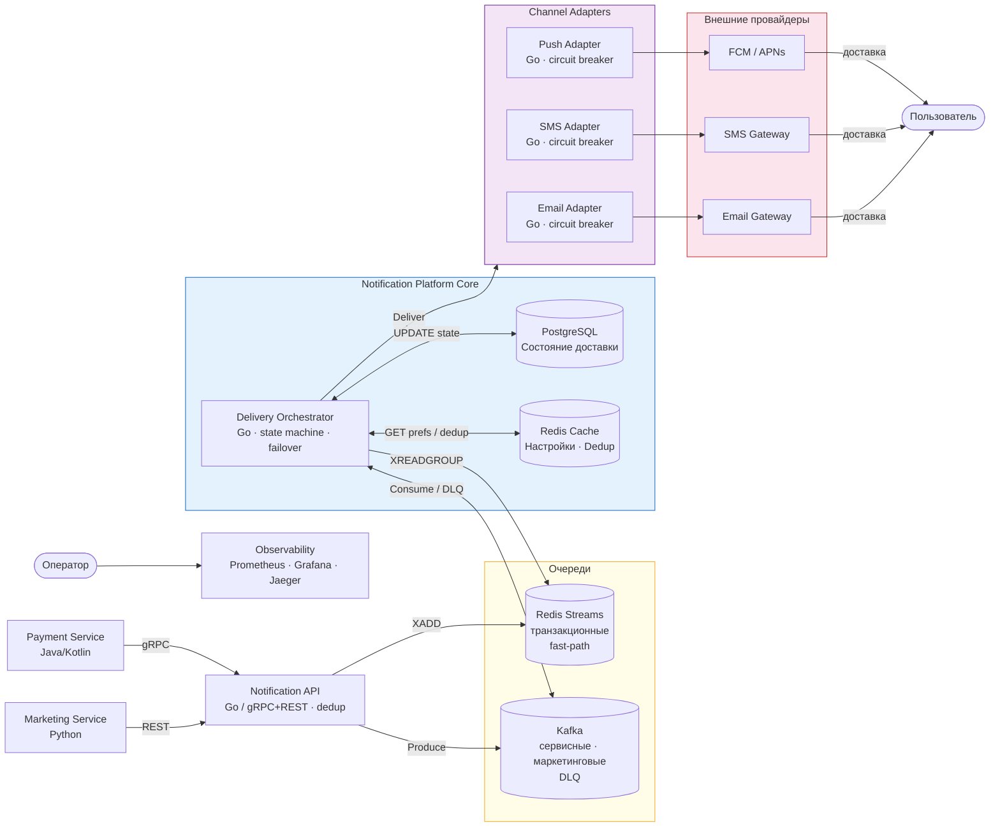
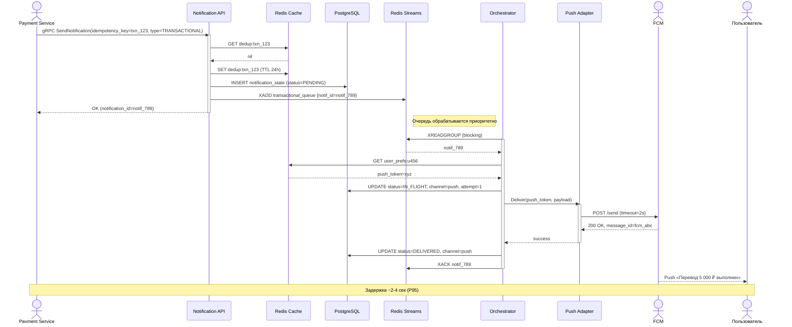
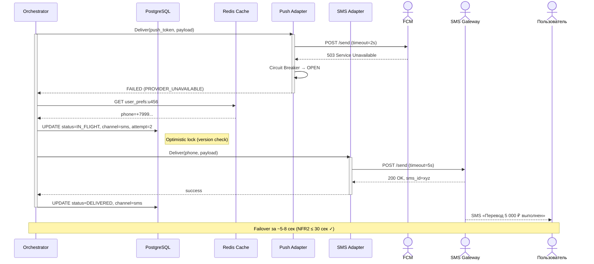
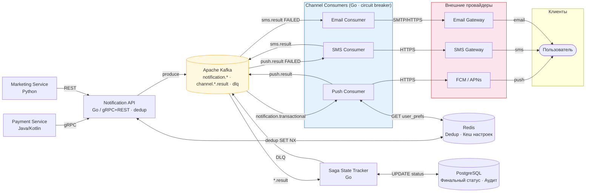
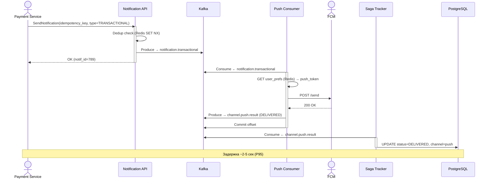
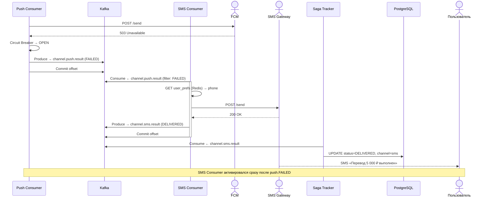

# RFC: Механизм гарантированной доставки критичных уведомлений с автоматическим failover между каналами

| Метаданные | Значение |
|------------|----------|
| **Статус** | DESIGN |
| **Автор(ы)** | Илья Катаев |
| **Ответственный** | Илья Катаев |
| **Бизнес-заказчик** | Продукт / Безопасность |
| **Ревьюеры** | — |
| **Дата создания** | 2026-04-06 |
| **Дата обновления** | 2026-04-06 |

---

## Оглавление

1. [Контекст](#контекст)
2. [Продуктовый анализ](#продуктовый-анализ)
3. [Пользовательские сценарии](#пользовательские-сценарии)
4. [Статистика и расчёт нагрузки](#статистика-и-расчёт-нагрузки)
5. [Требования](#требования)
6. [Варианты решения](#варианты-решения)
7. [Сравнительный анализ](#сравнительный-анализ)
8. [Выводы](#выводы)
9. [Связанные задачи](#связанные-задачи)
10. [Приложения](#приложения)

---

## Контекст

### Проблема

В онлайн-банке каждая продуктовая команда (платежи, переводы, кредиты, кэшбэк) самостоятельно отправляет уведомления пользователям. Это привело к:

- Задержкам доставки: нет единой приоритизации, транзакционные уведомления ждут в очереди вместе с маркетинговыми.
- Дублированию: при ретраях разные системы повторно отправляют одно и то же уведомление.
- Отсутствию failover: если SMS-шлюз недоступен, уведомление просто теряется.
- Невозможности аудита: нет единой точки для проверки статуса доставки.

### Фокус данного RFC

Этот RFC описывает подсистему гарантированной доставки критичных (транзакционных) уведомлений в рамках централизованной Notification Platform. Транзакционные уведомления (подтверждение перевода, уведомление о списании) требуют особого подхода:

- Пользователь не может отключить их полностью (только выбрать предпочтительный канал).
- Задержка доставки > 10 секунд — нарушение пользовательского опыта и потенциальный повод для жалобы в ЦБ.
- Недоставка критичного уведомления может восприниматься как признак мошенничества или сбоя.

### Ключевые вопросы

- Как гарантировать доставку через хотя бы один канал при сбоях провайдеров?
- Как предотвратить дублирование при failover?
- Как не допустить, чтобы маркетинговые кампании деградировали задержку критичных уведомлений?

---

## Продуктовый анализ

### Типы уведомлений и их свойства

| Тип | Примеры | Можно отключить? | Макс. задержка | Стоимость дубля |
|-----|---------|-----------------|----------------|-----------------|
| Транзакционные | Перевод выполнен, списание 5 000 ₽ | Нет (только канал) | 10 сек | Высокая (тревога пользователя) |
| Сервисные | Статус заявки, напоминание о платеже | Да | 5 минут | Средняя |
| Маркетинговые | Акция, кэшбэк, спецпредложение | Да | 1 час | Низкая |

### Каналы доставки и их характеристики

| Канал | Задержка доставки | Надёжность | Стоимость | Ограничения |
|-------|------------------|-----------|-----------|-------------|
| Push (FCM/APNs) | 1–3 сек | ~97% (зависит от активности устройства) | Бесплатно | Требует активного приложения и токена |
| SMS | 3–10 сек | ~99% | ~4–8 ₽/сообщение | Rate limits у операторов |
| Email | 10–60 сек | ~95% (с учётом спам-фильтров) | ~0.1–0.5 ₽/письмо | Низкая срочность |

### Приоритет каналов для транзакционных уведомлений

По умолчанию (если пользователь не изменил): Push → SMS → Email

Логика: Push — самый дешёвый и быстрый. SMS — надёжнее при отсутствии интернета. Email — последний резерв.

---

## Пользовательские сценарии

| Приоритет | Тип сценария | Действующее лицо | Сценарий |
|-----------|--------------|------------------|----------|
| MUST HAVE | Happy path | Пользователь банка | Совершает перевод → получает push-уведомление «Перевод на 5 000 ₽ выполнен» в течение 5 секунд |
| MUST HAVE | Failover | Пользователь банка | Push-провайдер недоступен → автоматически получает SMS в течение 30 секунд |
| MUST HAVE | Настройки | Пользователь банка | Меняет предпочтительный канал уведомлений с push на SMS → следующее транзакционное уведомление приходит по SMS |
| MUST HAVE | Наблюдаемость | Специалист поддержки | Проверяет статус конкретного уведомления по ID транзакции → видит: «Попытка push — ошибка → fallback на SMS — доставлено» |
| SHOULD HAVE | Дедупликация | Система | При двойном срабатывании события (баг вызывающего сервиса) → пользователь получает уведомление только один раз |
| SHOULD HAVE | Массовый failover | Система | SMS-шлюз упал → все транзакционные уведомления автоматически переключаются на push или email, без ручного вмешательства |
| COULD HAVE | In-app fallback | Пользователь банка | Если ни push, ни SMS, ни email не дали delivery receipt — уведомление показывается внутри приложения при следующем открытии |

---

## Статистика и расчёт нагрузки

### Исходные данные

- MAU: 10 000 000 пользователей
- DAU: 3 000 000 пользователей
- Peak Concurrent Users: 300 000 пользователей
- Транзакционных уведомлений на DAU: 2/день
- Сервисных: 3/день
- Маркетинговых: до 5/день (из расчёта на MAU, кампании)

### Расчёт нагрузки

```
Транзакционные:
  3 000 000 DAU × 2 = 6 000 000 уведомлений/день
  Среднее: 6 000 000 / 86 400 = 69 RPS
  Пик (утро / вечер, ×3): ~210 RPS

Сервисные:
  3 000 000 DAU × 3 = 9 000 000 уведомлений/день
  Среднее: 104 RPS, пик: ~300 RPS

Маркетинговые (кампания 1M пользователей за 1 час):
  1 000 000 / 3 600 = ~278 RPS (burst)
  Теор. максимум (все MAU × 5 / 86400) = 579 RPS, реальное среднее при охвате ~1M/день: ~58 RPS

Суммарный пиковый RPS (с маркетингом):
  210 (транз.) + 300 (серв.) + 278 (марк.) = ~790 RPS
  Закладываем запас ×2.5 = 2 000 RPS (соответствует NFR2)
```

### Хранилище состояний доставки

```
Объём одной записи: ~500 байт (notification_id, user_id, type, channel, status, timestamps, attempts)
30 000 000 уведомлений/день × 500 байт = 15 GB/день
Retention: 90 дней → 1.35 TB (сжатие ×3 → ~450 GB)
```

### Оценка стоимости SMS

```
При отказе push 20% транзакционных уходит в SMS:
  6 000 000 / день × 20% = 1 200 000 SMS/день
  1 200 000 × 6 ₽ = 7 200 000 ₽/день → неприемлемо при массовом fallback
  
Целевой показатель: SMS ≤ 5% от транзакционных в нормальном режиме
  = 300 000 SMS/день × 6 ₽ = 1 800 000 ₽/день (≈ 54M ₽/мес)
  Это базовая стоимость; оптимизируется через push-first стратегию
```

---

## Требования

### Функциональные требования (подсистема гарантированной доставки)

| № | Приоритет | Обозначение | Требование |
|---|-----------|-------------|------------|
| 1 | MUST HAVE | FR1 | Система принимает запрос на транзакционное уведомление и гарантирует попытку доставки хотя бы через один канал |
| 2 | MUST HAVE | FR2 | При недоступности основного канала система автоматически пробует резервные каналы в соответствии с приоритетом: push → SMS → email |
| 3 | MUST HAVE | FR3 | Система не допускает доставки одного уведомления дважды по одному каналу, даже при ретраях и failover |
| 4 | MUST HAVE | FR4 | Каждое уведомление имеет отслеживаемый статус (pending / in_flight / delivered / failed / dead_letter) |
| 5 | MUST HAVE | FR5 | Система учитывает пользовательский приоритет каналов при выборе основного и резервного |
| 6 | SHOULD HAVE | FR6 | При получении delivery receipt от провайдера система прекращает попытки по остальным каналам |
| 7 | SHOULD HAVE | FR7 | Уведомления, не доставленные ни по одному каналу, попадают в Dead Letter Queue с алертом |
| 8 | COULD HAVE | FR8 | In-app fallback: если не получен delivery receipt ни по одному каналу в течение 10 минут, уведомление показывается в приложении |

### Нефункциональные требования

| № | Приоритет | Обозначение | Требование |
|---|-----------|-------------|------------|
| 1 | MUST HAVE | NFR1 | Транзакционное уведомление передано во внешний провайдер ≤ 3 сек (P95) от момента получения |
| 2 | MUST HAVE | NFR2 | Failover на резервный канал выполняется ≤ 30 сек от первого сбоя |
| 3 | MUST HAVE | NFR3 | Вероятность дублированной доставки < 0.01% |
| 4 | MUST HAVE | NFR4 | Доступность сервиса приёма ≥ 99.95% (≤ 4.4 ч простоя в год) |
| 5 | MUST HAVE | NFR5 | Пиковая нагрузка маркетингового трафика не влияет на задержку транзакционных уведомлений |
| 6 | MUST HAVE | NFR6 | Каждое уведомление имеет сквозной trace_id; доступны метрики P50/P95/P99 задержки по каналам |
| 7 | SHOULD HAVE | NFR7 | Доля SMS среди транзакционных ≤ 20% в нормальном режиме |

Расчёт нагрузки: см. раздел «Статистика».

### Архитектурно значимые требования (ASR)

| ASR | Приоритет | Описание |
|-----|-----------|---------|
| ASR-1 | Критичный | Задержка ≤ 3 сек (P95) для транзакционных → физически изолированный fast-path |
| ASR-2 | Критичный | Пиковая нагрузка 2 000 RPS без деградации → изоляция трафика по типам, горизонтальное масштабирование |
| ASR-3 | Критичный | Идемпотентность доставки (дубли < 0.01%) → persistent state machine + deduplication |
| ASR-4 | Высокий | Failover ≤ 30 сек при сбое провайдера → circuit breaker + retry queue |

---

## Варианты решения

---

### Вариант 1: Centralized Orchestrator (Оркестратор с приоритетными очередями)

> **Описание:** Единый Delivery Orchestrator управляет всем жизненным циклом уведомления. Транзакционные уведомления обрабатываются через выделенную высокоприоритетную очередь (Redis Streams), маркетинговые и сервисные — через Kafka. Оркестратор хранит state machine в PostgreSQL и реализует логику failover напрямую.

#### Архитектура (C4 Container)



#### State Machine уведомления

```
PENDING
  │
  ▼ (Orchestrator взял уведомление)
IN_FLIGHT (channel=push)
  │
  ├── Успех → DELIVERED ✓
  │
  └── Ошибка/таймаут (или circuit breaker OPEN)
        │  * при transient-ошибке: до 2 retry на том же канале
        │  * при circuit breaker OPEN или исчерпании retry → failover
        ▼
      IN_FLIGHT (channel=sms, attempt=2)
        │
        ├── Успех → DELIVERED ✓
        │
        └── Ошибка
              │
              ▼
           IN_FLIGHT (channel=email, attempt=3)
              │
              ├── Успех → DELIVERED ✓
              │
              └── Все каналы исчерпаны
                    │
                    ▼
                 DEAD_LETTER → Kafka DLQ + Alert
```

#### Sequence Diagram — Happy Path (push доступен)



#### Sequence Diagram — Failover (push недоступен, fallback на SMS)



#### Как решение удовлетворяет ASR

| ASR | Как удовлетворяется |
|-----|-------------------|
| ASR-1 (задержка ≤ 3 сек) | Транзакционные → Redis Streams (sub-millisecond latency очереди). Оркестратор: Consumer → проверка cache → вызов провайдера. Без Kafka overhead на критичном пути. |
| ASR-2 (2000 RPS, изоляция) | Маркетинговые в отдельных Kafka-топиках, consumer-группы изолированы. Redis Streams для транзакционных не разделяет ресурсы с Kafka. |
| ASR-3 (идемпотентность) | Deduplication key в Redis (TTL 24h) при приёме. Optimistic locking при UPDATE state в PostgreSQL. XACK только после успешного UPDATE. |
| ASR-4 (failover ≤ 30 сек) | Circuit breaker в каждом Adapter. State machine в Orchestrator с явными переходами. Retry с немедленным переходом на следующий канал при OPEN circuit. |

#### Конкретные технологии

| Компонент | Технология | Обоснование |
|-----------|-----------|-------------|
| Транзакционная очередь | Redis Streams 7.x | Sub-ms latency, consumer groups, persistence, XACK семантика |
| Очередь маркетинговых/сервисных | Apache Kafka 3.x | Высокая пропускная способность, партиционирование, replay |
| State storage | PostgreSQL 16 | ACID-гарантии, optimistic locking, партиционирование по дате |
| Кеш настроек / dedup | Redis 7.x | In-memory, TTL, атомарные операции (SET NX) |
| API Gateway | Go + gRPC + grpc-gateway | Производительность, строгая типизация, HTTP/gRPC |
| Orchestrator | Go | Высокое concurrency (goroutines), низкие накладные расходы |
| Circuit Breaker | go-resilience / sony/gobreaker | Стандартный паттерн, настраиваемые пороги |
| Observability | Prometheus + Grafana + Jaeger | OpenTelemetry trace_id сквозной, алерты на DLQ |

#### Этапы реализации

| Этап | Описание | Срок | Ресурсы | Риски |
|------|----------|------|---------|-------|
| 1 | Notification API + дедупликация + Redis Streams | 3 нед | 2 бэкенд | Схема идемпотентного ключа |
| 2 | Orchestrator + state machine + Push Adapter | 3 нед | 2 бэкенд | Сложность state machine |
| 3 | SMS Adapter + Email Adapter + Circuit Breaker | 2 нед | 1 бэкенд | SLA провайдеров |
| 4 | Kafka для сервисных/маркетинговых + DLQ | 2 нед | 1 бэкенд | Настройка партиций |
| 5 | Observability + нагрузочное тестирование | 2 нед | 1 бэкенд + 1 SRE | Тюнинг под нагрузку |

#### Преимущества

- Единая точка логики failover — проще отлаживать и тестировать.
- Физическое разделение транзакционной и маркетинговой очередей (Redis vs Kafka).
- State machine в PostgreSQL даёт полный аудит истории попыток.
- Понятная точка ответственности: Orchestrator знает всё о каждом уведомлении.

#### Недостатки

- Orchestrator — единая точка отказа (нужен hot-standby, leader election).
- При 2000 RPS пиковой нагрузки Orchestrator должен быть хорошо масштабирован (stateless + шардирование по user_id).
- Redis Streams требует careful memory management (eviction policy).
- PostgreSQL под нагрузкой 2000 UPDATE/сек требует настройки (connection pooling, partitioning).

---

### Вариант 2: Event-Driven Choreography + Saga (Хореография с сагой)

> **Описание:** Вместо центрального оркестратора каждый канал доставки имеет свой независимый сервис-Consumer с собственной очередью. Координация failover реализована через Saga-паттерн: каждый канал публикует события успеха/неудачи, следующий канал «слушает» и активируется при получении события-ошибки. Единого оркестратора нет — логика распределена между сервисами.

#### Архитектура (C4 Container)



#### Sequence Diagram — Happy Path



#### Sequence Diagram — Failover



#### Как решение удовлетворяет ASR

| ASR | Как удовлетворяется |
|-----|-------------------|
| ASR-1 (задержка ≤ 3 сек) | Транзакционные в отдельном Kafka-топике с высоким приоритетом consumer-группы. Но: дополнительная задержка на Kafka produce + consume (~5-50ms). Жёстче к настройке, чем Redis Streams. |
| ASR-2 (2000 RPS, изоляция) | Полная изоляция по топикам и consumer-группам. Каждый канал масштабируется независимо. Нет единого узкого места. |
| ASR-3 (идемпотентность) | Dedup в API Gateway (Redis). Kafka Exactly Once Semantics (EOS) при produce. Saga Tracker обновляет финальный статус атомарно. Риск: если Push Consumer failed после отправки, но до коммита — возможен retry и повторная отправка (mitigation: idempotent push API FCM). |
| ASR-4 (failover ≤ 30 сек) | SMS Consumer подписан на push.result(FAILED) и активируется немедленно — задержка = latency Kafka (< 1 сек). Circuit breaker в каждом Consumer. |

#### Конкретные технологии

| Компонент | Технология | Обоснование |
|-----------|-----------|-------------|
| Брокер сообщений | Apache Kafka 3.x (KRaft) | Единый брокер для всех топиков, Exactly Once Semantics, Log Compaction |
| State storage | PostgreSQL 16 | ACID для финального статуса (только Saga Tracker пишет) |
| Dedup / настройки | Redis 7.x | Те же функции, что в Варианте 1 |
| Consumers | Go | Лёгкие, stateless, легко масштабируются |
| Kafka EOS | Transactional Producer + Idempotent Consumer | Для критичного пути (notification.transactional) |
| Circuit Breaker | sony/gobreaker | Изолирован в каждом Consumer |
| Observability | OpenTelemetry + Prometheus + Grafana | Единый trace_id через Kafka headers |

#### Этапы реализации

| Этап | Описание | Срок | Ресурсы | Риски |
|------|----------|------|---------|-------|
| 1 | Kafka топология, Notification API | 2 нед | 2 бэкенд | Kafka EOS настройка |
| 2 | Push Consumer + circuit breaker | 2 нед | 1 бэкенд | FCM/APNs интеграция |
| 3 | SMS + Email Consumer | 2 нед | 1 бэкенд | Провайдеры |
| 4 | Saga Tracker + DLQ + PostgreSQL | 2 нед | 1 бэкенд | Eventual consistency |
| 5 | Observability + тестирование failover | 2 нед | 1 бэкенд + 1 SRE | Сложность тестирования distributed |

#### Преимущества

- Нет единой точки отказа: каждый Consumer работает независимо.
- Истинная горизонтальная масштабируемость: добавляем партиции и Consumer-инстансы.
- Легко добавить новый канал (новый Consumer + новый топик).
- Kafka как единственный брокер (нет Redis Streams + Kafka).

#### Недостатки

- Более высокая задержка на критичном пути: Kafka produce + consume добавляет 5–50ms.
- Сложнее отлаживать: логика распределена по нескольким сервисам.
- Kafka Exactly Once Semantics имеет нюансы и overhead (~30% производительности).
- При частичном failover (Push delivered AND SMS triggered) нужна логика отмены — сложнее, чем в оркестраторе.
- Более сложный observability: трейс проходит через несколько Consumer-групп.

---

## Сравнительный анализ

### Ресурсные требования

| Критерий | Вариант 1 (Orchestrator) | Вариант 2 (Choreography) |
|----------|--------------------------|--------------------------|
| Время реализации | ~12 недель | ~10 недель |
| Команда | 3 бэкенд + 1 SRE | 3 бэкенд + 1 SRE |
| Инфраструктура | Kafka + Redis Streams + Redis Cache + PostgreSQL | Kafka + Redis Cache + PostgreSQL |
| Сложность операций | Средняя (Orchestrator — центральный сервис) | Высокая (много Consumer-сервисов) |
| Сложность отладки | Низкая (единая точка) | Высокая (распределённая логика) |

### Соответствие требованиям

| Требование | Вариант 1 | Вариант 2 |
|------------|-----------|-----------|
| FR1 (единый вход) | Да | Да |
| FR2 (failover по каналам) | Orchestrator переключает каналы явно внутри одного процесса | Failover реализован через события: SMS Consumer читает push.result(FAILED) из Kafka. Нет единого места, где видна полная логика переключения |
| FR3 (без дублей) | Redis dedup на входе + optimistic lock при UPDATE в PostgreSQL | Dedup на входе + Kafka EOS. При сбое Consumer после отправки, но до commit offset, возможен retry — нужен idempotency key на стороне провайдера |
| FR4 (статус уведомления) | State machine в PostgreSQL с историей попыток | Saga State Tracker собирает финальный статус из событий, промежуточные состояния менее прозрачны |
| FR5 (приоритет каналов) | Orchestrator читает настройки из Redis Cache на критичном пути | Каждый Consumer самостоятельно читает настройки из Redis Cache |
| FR6 (остановка при delivery receipt) | Orchestrator переводит статус в DELIVERED — остальные попытки не запускаются | Если push.result(DELIVERED) пришёл с задержкой, а SMS Consumer уже начал обработку — нужна явная проверка статуса перед отправкой |
| NFR1 (≤ 3 сек, P95) | Redis Streams: overhead очереди < 1ms | Kafka: overhead produce+consume 5–50ms. Укладывается в SLA, но бюджет на вызов провайдера меньше |
| NFR2 (2000 RPS без деградации) | Изолированные очереди: Redis Streams для транзакционных, Kafka для остальных | Изоляция через отдельные Kafka-топики и consumer-группы |
| NFR3 (дубли < 0.01%) | Выполняется при корректной реализации optimistic locking | Выполняется при правильной настройке Kafka EOS — сложнее в эксплуатации |
| NFR4 (доступность ≥ 99.95%) | Orchestrator — единая точка отказа. Требует hot-standby и leader election | Потеря одного Consumer-сервиса не роняет систему — остальные продолжают работать |
| NFR5 (изоляция трафика) | Redis Streams физически отделён от Kafka | Изоляция через топики и consumer-группы внутри одного Kafka-кластера |
| NFR6 (наблюдаемость) | Полная картина доставки в одном месте — Orchestrator | Трейс собирается из событий нескольких Consumer-групп, требует сквозной корреляции по trace_id |

### Ключевые компромиссы

| Аспект | Вариант 1 | Вариант 2 |
|--------|-----------|-----------|
| Отладка инцидента | Весь жизненный цикл уведомления виден в одном сервисе и одной таблице в БД | Нужно собирать события из нескольких Kafka-топиков и сервисов |
| Задержка на критичном пути | Redis Streams добавляет < 1ms к задержке | Kafka добавляет 5–50ms, что сокращает бюджет на вызов провайдера |
| Отказоустойчивость платформы | Падение Orchestrator останавливает обработку транзакционных уведомлений | Падение одного Consumer не влияет на остальные каналы |
| Добавление нового канала | Новый Adapter + логика в Orchestrator, деплой одного сервиса | Новый Consumer-сервис + новые Kafka-топики, независимый деплой |
| Инфраструктура | Kafka + Redis Streams + Redis Cache + PostgreSQL (4 компонента) | Kafka + Redis Cache + PostgreSQL (3 компонента) |

---

## Выводы

Рекомендуется Вариант 1 — Centralized Orchestrator.

Главный аргумент — задержка. Redis Streams добавляет к критичному пути меньше миллисекунды, тогда как Kafka добавляет 5–50ms. При SLA 3 сек P95 это не катастрофа, но бюджет на вызов провайдера становится ощутимо меньше. Для транзакционных уведомлений банка это принципиально.

Второй аргумент — предсказуемость поведения при сбоях. В Варианте 1 Orchestrator обновляет статус в PostgreSQL до отправки и делает XACK только после успеха. Граница гарантий очевидна. В Варианте 2 Kafka EOS в теории даёт те же гарантии, но на практике требует правильной конфигурации transactional producer, а угловые случаи (Consumer упал после отправки, но до commit offset) отлаживать значительно сложнее.

Третий аргумент — операционная простота на старте. Когда что-то пойдёт не так с конкретным уведомлением, инженер открывает один сервис и одну таблицу в PostgreSQL, а не собирает события из нескольких Kafka-топиков с distributed trace. Вариант 2 требует зрелой observability-инфраструктуры, которой на старте, как правило, нет.

### Компромиссы и ограничения

Orchestrator — единая точка отказа. Решается через stateless-дизайн с шардированием по user_id и hot-standby с leader election (etcd). Это дополнительная операционная нагрузка, но управляемая.

Добавление Redis Streams к инфраструктуре — осознанный выбор: Redis уже используется для кеша, операционно не новый компонент. Маркетинговый трафик намеренно держится в Kafka, чтобы не смешивать в одной технологии разные SLA.

Узкие места, которые нужно отработать до запуска:
- Redis Streams требует репликации (Redis Sentinel или Cluster) — потеря мастера останавливает обработку транзакционных уведомлений.
- PostgreSQL при 2000 UPDATE/сек нужно настроить через PgBouncer и партиционирование таблицы notification_state по дате.
- Когда circuit breaker открывается на 30 сек, доля SMS временно растёт — нужен алерт на стоимость, иначе это будет замечено только в конце месяца по счёту.

---

## Связанные задачи

| Тип | Описание |
|-----|---------|
| Зависимость | Сервис управления пользовательскими настройками уведомлений (preferences service) — должен быть реализован до запуска Notification Platform |
| Зависимость | Интеграция с push-провайдерами (FCM, APNs) — требует регистрации приложения и получения credentials |
| Зависимость | Выбор и подключение SMS-шлюза — тендер, SLA, contract |
| Зависимость | Сервис аутентификации банковских сервисов — для авторизации вызовов к Notification API |
| Следствие | Миграция существующих отправок уведомлений из Payment Service, Marketing Service и других команд на новый API |
| Следствие | Разработка SLA-дашборда для команды поддержки (на базе Grafana) |
| Следствие | Runbook для on-call инженеров: действия при росте DLQ, открытии circuit breaker, деградации провайдера |

---

## Приложения

### Глоссарий

| Термин | Определение |
|--------|-------------|
| Транзакционное уведомление | Критичное уведомление о финансовой операции (перевод, списание). Нельзя отключить. |
| Idempotency Key | Уникальный ключ запроса, позволяющий обнаружить и отбросить дублирующийся запрос |
| Circuit Breaker | Паттерн отказоустойчивости: при превышении порога ошибок «открывает цепь» и прекращает вызовы к провайдеру на заданный период |
| Outbox Pattern | Паттерн атомарной записи события и бизнес-данных в одну транзакцию БД |
| Dead Letter Queue (DLQ) | Очередь для сообщений, которые не удалось обработать после всех попыток |
| Saga | Паттерн управления распределёнными транзакциями через последовательность локальных транзакций с компенсирующими операциями |
| Exactly Once Semantics (EOS) | Гарантия Kafka: сообщение записано и прочитано ровно один раз, даже при сбоях |
| Redis Streams | Структура данных Redis для потоков событий с consumer groups и XACK-семантикой |
| State Machine | Конечный автомат: явное описание состояний уведомления и допустимых переходов между ними |
| Fast-path | Выделенный код/инфраструктурный путь для критичных операций с минимальными накладными расходами |
| MAU / DAU | Monthly/Daily Active Users — месячная/суточная аудитория |
| P95 / P99 | 95-й / 99-й перцентиль задержки (95% / 99% запросов выполняются быстрее этого значения) |
